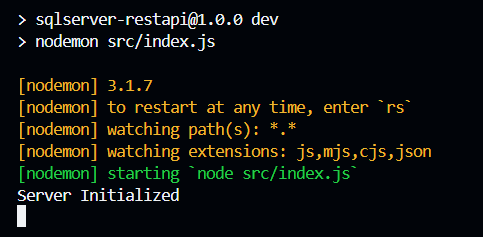

# node-sqlserver-restapi

## Table of contents

- [node-sqlserver-restapi](#node-sqlserver-restapi)
  - [Table of contents](#table-of-contents)
  - [Introduction](#introduction)
  - [Connection](#connection)
  - [Products Controllers](#products-controllers)
    - [How it works?](#how-it-works)
    - [Inserting a new controller](#inserting-a-new-controller)
  - [Settings](#settings)
  - [Execution](#execution)

## Introduction

This is an API created to connect SQL Server with Node. Mostly useful for web-developpers. Read this document to implement this API correctly!

## Connection

First of all, if you want to have this repository on your local device, then clone this repository. You can do that with git in the cmd:

```cmd
# git clone https://github.com/Cortes64/node-sqlserver-restapi
```

Before you run the API, you'll need to set it up. Is recommended to open this folder in **Visual Studio Code**. Once in the folder, open the following path: **src/database/connection.js**. Then, change the constant **dbSettings** to have your settings.

```javascript
const dbSettings = {
    user: "PutYourUserName",
    password: "PutYourPassword",
    server: "PutYourServerName",
    database: "PutYourDatabaseName",
    options: {
        encrypt: false,
        trustServerCertificate: true,
    }
}
```

Instead of **PutYourUserName** put your user name of the sql server. Then, do the same with the following.

> *Warning: If you're trying the API locally and you want to check the data inside your database, then leave the encrypt option false. If you don't want anyone to read the data, then set the **encrypt option** true.*

## Products Controllers

Once this step is completed and you've chosen your database, you'll have to set up the **products.controllers.js** file in the **src/controllers** path.

### How does it works?

Let's get the following example:

```javascript
export const updateProduct = async (req, res) => {
    const pool = await getConnection() //;
    const result = await pool
        .request()
        .input('id', sql.Int, req.params.id)
        .input('name', sql.VarChar, req.body.name)
        .input('description', sql.Text, req.body.description)
        .input('price', sql.Decimal, req.body.price)
        .input('quantity', sql.Int, req.body.quantity)
        .query("UPDATE products SET name = @name, quantity = @quantity, price = @price, description = @description WHERE id = @id;");
}
```

This constant's purpose is to update a product in a specific database. The test database is **products**, but you can change it to the name you have for your database. pool is the connection to the server. The result constant is the result of the query. If you want to make changes, there's some things you may do:

* After the pool, theres lots of options. 
* ```.request()``` will always be necesary, is a way to say that is requesting to do something to the database.
* ```.input('name', sql.type, req.params/body.name)``` This is the syntax of an attribute. You first put the name of the attribute, then sql.(the type of the attribute) and finally req.(body or params).(name of the attribute). body is the variable you insert into the ```.query()``` section. For example, we put req.body.quantity and in the query section we put ```@quantity```, this will be the variable inserted by the user.
* ```.query```. The field you insert a string with the query you want to do to the database.

### Inserting a new controller

This is a CRUD database but you can create your own functions according to your conveniences. If you want to do that, what we recommend is to create with the syntaxis of the example and to insert a new route to the file **products.routes.js** on the following path: **src/routes**. Then, following the next syntax:

```javascript
router.put('/products/:id', updateProduct)
```

If you don't need an id, you can remove it:

```javascript
router.post('/products', createProduct)
```

## Settings

Add a file called `config.js` in the src folder. It should look like this:

```javascript
export const dbSettings = {
    user: "yourUser",
    password: "yourPassword",
    server: "yourServer",
    database: "yourDatabaseName",
    options: {
        encrypt: false, // change it to true when using in an app
        trustServerCertificate: true,
    }
}
```

## Execution

Executing the program is easy. You only need to open a terminal and open the path in which the API is. Then, run the following command: ```npm run dev```. You'll see this:



If you want to cancel the process, press `Ctrl+C`. If you don't have npm, you'll have to install it. 

